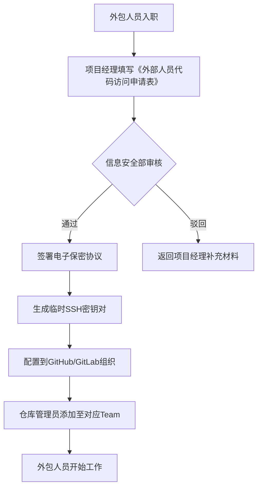

# 外包人员代码访问权限管理办法

| 文档编号 | SOP-SEC-003 | 版本号 | v2.1 |
|----------|-------------|--------|------|
| 制定部门 | 信息安全部 | 负责人 | 张宁 |
| 生效日期 | 2025-06-01 | 审批人 | 王伟 |

## 变更记录

| 版本 | 日期 | 修改内容 | 修改人 |
|------|------|----------|--------|
| v1.0 | 2024-03-10 | 初始版本 | 李敏 |
| v2.0 | 2025-01-15 | 增加GitHub仓库权限分级、SSH密钥轮换机制 | 张宁 |
| v2.1 | 2025-05-20 | 新增外包人员代码审计流程、紧急权限回收流程 | 张宁 |

## 1. 目的

为规范外包人员对公司代码仓库的访问行为，降低代码泄露、恶意篡改和未授权访问风险，特制定本办法。本办法适用于所有与公司签订外包服务合同、需访问公司代码仓库的外部人员。

## 2. 适用范围

- 所有外包服务供应商及其指派的外包人员
- 所有托管在GitHub Enterprise、GitLab Self-Managed以及内部Git服务器的代码仓库
- 涉及公司核心业务、算法、数据管道等敏感代码库

## 3. 职责分工

| 角色 | 职责 |
|------|------|
| 项目经理 | 发起权限申请，确认外包人员工作范围与期限 |
| 信息安全部 | 审批权限，配置SSH密钥，定期审计 |
| 代码仓库管理员 | 配置仓库访问级别，执行权限回收 |
| 外包人员 | 签署保密协议，遵守访问规范 |

## 4. 权限分级与申请流程

### 4.1 权限等级定义

| 等级 | 代码库范围 | 允许操作 | 有效期 |
|------|------------|----------|--------|
| L1-只读 | 非核心业务库、文档库、测试库 | clone, pull, fetch, 浏览issue | 最长30天 |
| L2-贡献者 | 边缘业务库、公共库 | push到非主分支，创建PR | 最长60天 |
| L3-维护者 | 特定模块库（需项目总监审批） | merge PR，管理分支 | 最长90天 |
| L4-管理员 | **禁止对外包人员开放** | 所有操作 | 不适用 |

### 4.2 申请流程



### 4.3 申请表内容

| 字段 | 说明 |
|------|------|
| 外包人员姓名 | 与身份证一致 |
| 所属供应商 | 公司全称 |
| 项目名称 | 对应Jira项目Key |
| 需要访问的仓库列表 | 每个仓库需独立填写 |
| 申请权限等级 | L1/L2/L3 |
| 预计结束日期 | 精确到日 |
| 项目经理签名 | 需部门总监以上审批 |

## 5. 技术实施规范

### 5.1 SSH密钥管理

所有外包人员必须使用公司统一生成的临时SSH密钥对，禁止使用个人密钥。

```bash
# 信息安全部执行命令（示例）
ssh-keygen -t ed25519 -C "outsource-20250601-zhangsan" -f /tmp/zhangsan_ed25519 -N ""
```

- 密钥长度：ed25519 或 RSA 4096 位
- 密钥有效期：与权限有效期一致，到期自动失效
- 密钥存储：公钥上传至GitHub Enterprise组织设置，私钥通过企业加密邮件发送给外包人员

### 5.2 仓库访问控制

使用GitHub Team进行权限管理，Team命名规则：

```
<project>-<role>-<vendor>
```

例如：
- `payment-core-read-vendorA`
- `data-pipeline-contributor-vendorB`

```yaml
# GitLab项目访问配置示例（仅作参考）
project:
  name: payment-core
  visibility: private
  members:
    - user: zhangsan@vendorA.com
      access_level: developer  # 对应L2
    - user: lisi@vendorB.com
      access_level: reporter    # 对应L1
```

### 5.3 代码审计要求

- 所有L3级别的push操作，必须经过至少2名公司内部员工的Code Review
- 每次提交的commit message必须包含Jira ticket号，格式：`[PROJ-1234] 提交说明`
- 禁止将敏感信息（API Key、密码、配置）提交到仓库，所有敏感信息必须使用Vault或环境变量

## 6. 权限回收

### 6.1 自动回收

- 权限有效期到达后，由GitHub Actions定时任务自动移除外包人员Team成员身份
- 配置示例（GitHub Actions）：

```yaml
name: Auto-Revoke Outsourced Access
on:
  schedule:
    - cron: '0 8 * * *'  # 每天UTC 8:00执行

jobs:
  revoke:
    runs-on: ubuntu-latest
    steps:
      - name: Check and revoke expired members
        run: |
          # 调用内部API获取过期权限列表
          curl -X POST https://internal-api.company.com/revoke-expired \
            -H "Authorization: Bearer ${{ secrets.INTERNAL_API_TOKEN }}"
```

### 6.2 紧急回收

发生以下情况时，项目经理或信息安全部可发起紧急回收流程：
- 外包人员离职或合同终止
- 发现可疑操作（如非工作时间大量clone仓库）
- 安全事件通报

紧急回收流程：
1. 项目经理通过Slack发送 `/revoke_access <user_email>` 命令
2. 后端服务立即执行：移除Team成员 + 吊销SSH密钥 + 关闭GitHub账户（如适用）
3. 系统自动通知相关人员

## 7. 违规处理

| 违规行为 | 处罚措施 |
|----------|----------|
| 未经授权访问其他仓库 | 立即收回权限，通报供应商，暂停合作1个月 |
| 泄露代码到外部 | 永久拉黑，法律追责 |
| 使用个人密钥绕过认证 | 立即收回权限，扣除供应商履约保证金 |
| 未及时报告人员变更 | 警告一次，累计3次取消供应商资格 |

## 8. 附则

1. 本办法由信息安全部负责解释与修订，每年至少复审一次。
2. 所有外包人员必须在开始工作前完成本办法的在线培训（预计15分钟）。
3. 如本办法与供应商内部规定冲突，以本公司规定为准。

---

**附录A：相关文档**
- 《外部人员代码访问申请表》 (TEMPLATE-SEC-003A)
- 《外包人员保密协议模板》 (TEMPLATE-LEGAL-001)
- 《代码安全审计标准》 (SOP-SEC-005)

**附录B：紧急联系方式**
- 信息安全部值班：infosec@company.com
- 24小时应急：+86 400-888-0000 转 7