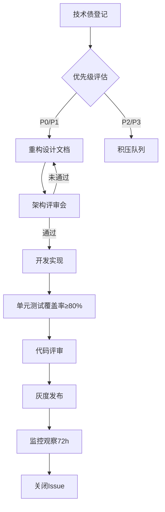

# 技术债管理制度与重构流程

| 文档编号 | TD-MGMT-001 | 版本号 | 2.3 |
|----------|-------------|--------|-----|
| 制定人 | 王明宇 | 审核人 | 刘静 |
| 生效日期 | 2024-03-15 | 更新周期 | 季度 |

## 1. 变更记录

| 版本号 | 变更日期 | 变更内容 | 负责人 |
|--------|----------|----------|--------|
| 1.0 | 2023-06-01 | 初始版本 | 王明宇 |
| 2.0 | 2023-10-20 | 新增四象限分类法及评分细则 | 陈晓峰 |
| 2.1 | 2024-01-10 | 修订重构优先级计算规则 | 刘静 |
| 2.3 | 2024-03-15 | 加入自动化工具集成要求 | 王明宇 |

## 2. 目的与适用范围

为系统化管理技术债（Technical Debt），降低因设计缺陷、代码质量下降及架构腐化导致的维护成本与风险，特制定本制度。

本制度适用于所有使用Java/Go/Python开发的微服务项目，包括新建项目及存量系统重构。涉及以下角色：

- 技术负责人（Tech Lead）
- 架构师（Architect）
- 开发工程师
- QA及DevOps工程师

## 3. 技术债分类与评估标准

### 3.1 四象限分类法

采用基于**严重性**与**修复成本**的四象限分类：

| 象限 | 严重性 | 修复成本 | 典型示例 | 行动要求 |
|------|--------|----------|----------|----------|
| 第一象限 | 高 | 低 | 未使用的 import、重复的常量定义 | 立即修复 |
| 第二象限 | 高 | 高 | 无单元测试的关键交易链路、硬编码数据库连接字符串 | 列入Sprint Backlog |
| 第三象限 | 低 | 低 | 注释过时、日志级别不当 | 技术债积压处理 |
| 第四象限 | 低 | 高 | 基于XML的旧版配置系统、过度耦合的模块 | 等待重构窗口 |

### 3.2 评分细则

每项技术债需评估以下维度（分值1-10）：

- **影响范围 (Impact)**：影响用户数或模块数，1=单函数，10=全系统
- **修复难度 (Effort)**：人天估算，1=<1天，10=>20天
- **业务风险 (Risk)**：上线可能导致的降级概率，1=极低，10=极高

**综合优先级分数 = Impact × 0.4 + Effort × 0.3 + Risk × 0.3**

分数 ≥ 7 列为 P0 级别，需在1个月内完成修复。

## 4. 技术债识别与登记

### 4.1 识别渠道

- 每周代码评审（Code Review）中发现的异味（Code Smell）
- 每月架构评审会（Architecture Review Meeting）
- 线上故障复盘（Incident Postmortem）
- 自动化工具扫描结果

### 4.2 登记流程

所有识别到的技术债必须在 **JIRA** 中创建类型为 `Technical Debt` 的 Issue，包含以下字段：

- **Summary**：如“order-service 中 OrderStatus 枚举字段命名不规范”
- **Description**：描述影响及建议方案
- **Labels**：`tech-debt`, `p0`/`p1`/`p2`
- **Fix Version**：计划修复的版本号

JQL 示例查询未修复的技术债：

```sql
project = "YourProject" AND issuetype = "Technical Debt" AND status != Done ORDER BY priority DESC, created ASC
```

## 5. 重构流程

### 5.1 流程阶段

采用标准SDLC流程，但增加“重构设计评审”环节。



### 5.2 重构设计文档模板

文档存放于 Confluence 空间，模板包含：

- **重构目标**：消除哪些具体技术债
- **影响分析**：列出所有受影响的服务、API、数据库
- **回滚方案**：必须包含 `rollback.sql` 或 `kubectl rollout undo` 命令
- **测试计划**：重点回归用例清单
- **安全审查**：是否需要安全团队介入

示例设计文档标题：

```
[重构设计] user-service 认证模块从 OAuth1 迁移至 OAuth2.0
```

## 6. 工具集成与自动化

### 6.1 静态代码扫描

所有项目必须配置 **SonarQube**，规则基线采用 `sonar-way` + 自定义规则：

| 规则 | 阈值 | 触发动作 |
|------|------|----------|
| 代码重复率 | >5% | 阻断CI Pipeline |
| 圈复杂度 | 单方法 >15 | 标记为代码异味 |
| 单元测试覆盖率 | <75% | 警告，需人工审批 |

### 6.2 自动化扫描命令

在 GitLab CI 中集成：

```yaml
sonar-analysis:
  stage: quality
  script:
    - sonar-scanner \
        -Dsonar.projectKey=${CI_PROJECT_NAME} \
        -Dsonar.sources=. \
        -Dsonar.host.url=${SONAR_HOST} \
        -Dsonar.login=${SONAR_TOKEN} \
        -Dsonar.coverage.exclusions=**/test/** \
        -Dsonar.exclusions=vendor/**,third_party/**
  only:
    - develop
    - master
    - merge_requests
```

## 7. 考核与问责

### 7.1 技术债指标

每个 Squad 的 **技术债偿还率** 必须 ≥ 70%：

```
偿还率 = （本季度已关闭的P0/P1技术债数）/（本季度应关闭的P0/P1技术债数）× 100%
```

### 7.2 负责人职责

- Tech Lead：每月输出技术债报告，识别 Top5 技术债
- 架构师：审批所有重构设计文档，参与架构评审
- 开发工程师：在个人Sprint中分配10%容量用于技术债修复

### 7.3 违规处理

- 连续两个季度偿还率 <50%：Tech Lead 需提交书面整改计划
- 因技术债导致P0线上事故：纳入部门季度绩效考核，扣减相应团队分数

## 8. 附录

### 8.1 常见技术债示例

```java
// 反例：大量重复的if-else
public String getStatusDescription(int status) {
    if (status == 0) return "待支付";
    else if (status == 1) return "已支付";
    else if (status == 2) return "已发货";
    // ... 30个分支
}
```

```go
// 反例：硬编码连接字符串
func connect() {
    conn, _ := sql.Open("mysql", "root:password@tcp(10.0.0.1:3306)/db")
}
```

### 8.2 相关文档

- 《代码规范与静态检查配置指南》（CODING-STD-002）
- 《架构评审会议程模板》（ARCH-REV-001）
- 《线上故障分级与响应流程》（INCIDENT-001）

---

**本文档最终解释权归架构委员会所有。**