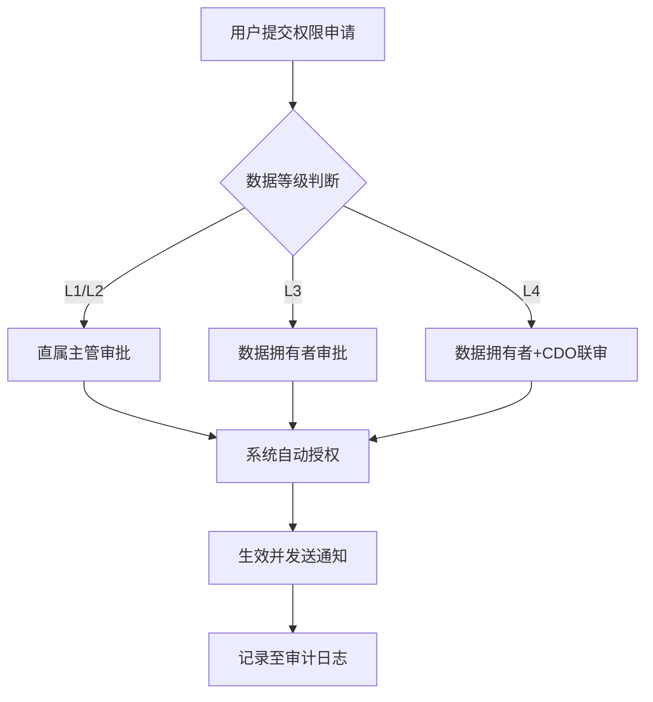

# 数据分类分级与访问权限管理办法

| 文档编号 | DP-AM-2024-001 | 版本号 | V3.2 |
|----------|---------------|--------|------|
| 制定部门 | 数据治理委员会 | 生效日期 | 2024-05-20 |
| 责任人 | 张敏（首席数据官） | 审核人 | 李伟（信息安全总监） |

## 变更记录

| 版本 | 日期 | 变更内容 | 变更人 |
|------|------|----------|--------|
| V1.0 | 2023-01-10 | 初始版本 | 王丽 |
| V2.0 | 2023-06-15 | 新增L4级别定义，调整审批流程 | 赵强 |
| V3.0 | 2024-03-01 | 集成GDPR要求，细化技术控制措施 | 张敏 |
| V3.2 | 2024-05-20 | 修订日志审计保留周期，修正附件链接 | 陈浩 |

---

## 1. 目的与适用范围

### 1.1 目的
为规范公司数据资产的分类分级管理，建立与数据安全等级匹配的访问控制机制，降低数据泄露、篡改及滥用风险，依据《数据安全法》《个人信息保护法》及ISO 27001标准，制定本办法。

### 1.2 适用范围
本办法适用于公司所有业务系统、数据仓库、数据湖及第三方数据交换平台中存储、处理、传输的结构化与非结构化数据。涵盖生产环境、测试环境及灾备环境的数据管理活动。

### 1.3 术语定义

| 术语 | 定义 |
|------|------|
| 数据资产 | 公司拥有或控制的，具有价值的数据集合，包括数据库表、文件、API数据流等 |
| 数据分类 | 按业务属性将数据划分为业务域的过程 |
| 数据分级 | 按数据敏感性及泄露影响程度划分安全等级 |
| 访问控制矩阵 | 定义角色-数据-权限三元关系的规则集合 |

## 2. 数据分类体系

### 2.1 分类原则
数据分类遵循业务驱动、唯一性、可扩展性原则。每个数据资产必须归属且仅归属一个业务域。

### 2.2 业务域分类表

| 业务域编码 | 业务域名称 | 负责人 | 包含数据示例 |
|-----------|-----------|--------|-------------|
| BIZ-CUS | 客户管理 | 张伟 | 客户基本信息、消费记录、投诉记录 |
| BIZ-EMP | 员工管理 | 李娜 | 员工档案、薪酬数据、考勤记录 |
| BIZ-FIN | 财务管理 | 王强 | 财务报表、交易流水、预算数据 |
| BIZ-PRD | 产品研发 | 刘洋 | 产品设计文档、源代码、测试用例 |
| BIZ-OPS | 运营支撑 | 陈静 | 系统日志、监控指标、配置参数 |
| BIZ-COM | 合规风控 | 赵敏 | 风险评估报告、审计记录、监管报送数据 |

### 2.3 分类流程
1. 数据拥有者（Data Owner）在数据资产注册时填写业务域归属。
2. 数据治理委员会每季度对新增数据资产进行分类复核。
3. 跨业务域数据需指定主业务域，并在元数据中标注关联域。

## 3. 数据分级标准

### 3.1 等级定义

| 等级 | 名称 | 定义 | 泄露影响示例 |
|------|------|------|-------------|
| L1 | 公开数据 | 可向公众公开且无需授权即可访问 | 公司官网信息、产品白皮书 |
| L2 | 内部数据 | 仅限公司内部员工使用，泄露可能造成轻微影响 | 内部通讯录、培训材料 |
| L3 | 敏感数据 | 涉及商业秘密或个人隐私，泄露将造成较大损失或法律风险 | 客户手机号、员工薪资、未公开财务报表 |
| L4 | 高度敏感数据 | 核心商业秘密或敏感个人信息，泄露将导致严重业务中断或巨额处罚 | 核心算法源码、支付密钥、生物识别信息 |

### 3.2 分级判定规则
数据分级采用“就高不就低”原则。当数据包含多个属性时，以最高等级属性为准。例如：客户信息表同时包含姓名（L2）和身份证号（L3），则该表整体定为L3。

具体判定维度包括：
- 数据内容敏感性
- 数据量规模（批量数据提升一级）
- 法律法规特殊要求（如GDPR规定特殊类别数据自动定为L4）
- 数据聚合风险（多源关联后可能提升等级）

### 3.3 分级调整
- 定期审核：每年1月由数据治理委员会组织全面分级复核。
- 事件驱动：发生数据安全事件或业务变更时，触发即时调整。
- 降级审批：L4降至L3需经首席数据官批准，L3降至L2需经数据治理委员会审批。

## 4. 访问权限管理

### 4.1 最小权限原则
所有用户、服务账号及应用程序仅被授予完成其职责所必需的最小数据权限集。默认拒绝所有未明确授权的访问。

### 4.2 权限矩阵

| 数据等级 | 查看权限 | 修改权限 | 导出权限 | 删除权限 | 审批要求 |
|---------|---------|---------|---------|---------|---------|
| L1 | 全员 | 数据拥有者 | 全员 | 数据拥有者 | 无 |
| L2 | 本部门员工 | 本部门主管及以上 | 数据拥有者 | 数据拥有者 | 部门主管审批 |
| L3 | 业务相关角色 | 数据拥有者及授权管理员 | 需单独申请 | 数据拥有者 | 数据拥有者+部门总监审批 |
| L4 | 最小授权名单 | 数据拥有者 | 禁止 | 数据拥有者+CDO | CDO+信息安全总监联审 |

### 4.3 权限申请与审批
权限申请需通过公司统一权限管理平台（IAM，版本2.5.1）提交，具体流程如下：

### 4.4 技术控制措施
按数据等级实施差异化的技术控制：

| 措施 | L1 | L2 | L3 | L4 |
|------|----|----|----|----|
| 传输加密（TLS 1.2+） | 可选 | 强制 | 强制 | 强制 |
| 存储加密（AES-256） | 可选 | 建议 | 强制 | 强制 |
| 数据脱敏 | 不适用 | 不适用 | 展示时脱敏 | 全生命周期脱敏 |
| 访问日志记录 | 保留30天 | 保留90天 | 保留1年 | 保留3年 |
| MFA认证 | 不要求 | 不要求 | 要求 | 要求 |
| 数据库防火墙 | 不启用 | 建议启用 | 强制启用 | 强制启用+实时告警 |

## 5. 角色与职责

| 角色 | 职责 | 任命方式 |
|------|------|---------|
| 数据拥有者（Data Owner） | 负责数据分类分级、审批权限申请、定期审计 | 业务部门总监担任 |
| 数据管理员（Data Custodian） | 实施技术控制措施、监控异常访问 | IT运维团队指定 |
| 数据使用者（Data User） | 按照授权使用数据，不得越权操作 | 全员 |
| 数据治理委员会 | 制定标准、处理争议、组织年度审核 | 跨部门组成 |
| 信息安全团队 | 监督执行、安全事件响应、技术工具运维 | 信息安全部 |

## 6. 审计与违规处理

### 6.1 定期审计
- 每季度由信息安全团队对L3/L4数据的访问日志进行抽样审计（样本量不低于10%）。
- 每年开展一次覆盖所有数据等级的全面权限审计。

### 6.2 违规处置
- 轻微违规（如未及时撤销离职员工权限）：通报批评，限期24小时内整改。
- 一般违规（如越权查看L2数据）：书面警告，暂停权限3天，参加安全培训。
- 严重违规（如泄露L3/L4数据）：立即冻结账号，启动调查流程，按照《员工违纪处理办法》给予纪律处分，情节严重者移交法务部门。

## 7. 附则

### 7.1 解释权
本办法由数据治理委员会负责解释和修订。

### 7.2 生效与废止
本办法自2024年5月20日起生效，原《数据安全管理规定》（V2.1）同时废止。

### 7.3 附件
- 附件A：数据分类分级申请单（模板）
- 附件B：权限申请标准操作流程（SOP）
-