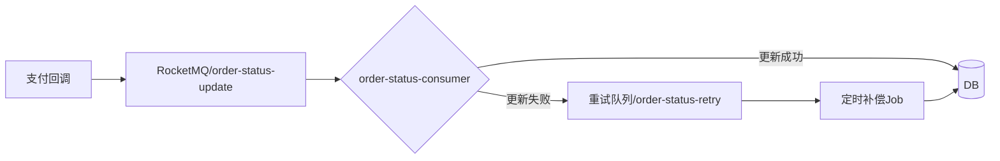

# 消息队列积压导致订单状态更新延迟复盘报告

| 文档编号 | OPS-RCA-2024-003 |
|----------|------------------|
| 创建日期 | 2024-03-15 |
| 最后更新 | 2024-03-18 |
| 负责人 | 张伟（SRE） |
| 状态 | 已定稿 |

## 1. 故障概述

**发生时间**：2024-03-14 14:22 UTC+8  
**恢复时间**：2024-03-14 15:47 UTC+8  
**故障时长**：1小时25分钟  
**影响范围**：交易系统（oms-order-svc）消息处理延迟，导致约 12,800 笔订单的状态更新延迟 30-60 分钟，涉及用户在线支付确认、物流发货触发等下游业务。

**严重等级**：P1（严重故障）

## 2. 影响评估

| 影响项 | 量化数据 |
|--------|----------|
| 受影响订单数 | 12,800 笔 |
| 最大延迟时间 | 62 分钟 |
| 平均延迟时间 | 41 分钟 |
| 下游重试请求数 | 3,200 次（物流、通知服务） |
| 用户投诉工单 | 47 个 |

## 3. 根因分析

### 3.1 直接原因

消息队列（Apache RocketMQ）中 **order-status-update** topic 的消费组 `order-consumer-group` 出现严重积压，积压消息数量峰值达到 **210,000 条**。

### 3.2 触发因素

1. **上游突发流量**：14:20 至 14:25 之间，支付回调服务（payment-callback-svc）在短时间内批量重发了约 15,000 条重复的状态更新消息。该重发行为由支付网关侧的一次超时重试逻辑 Bug 导致。

2. **消费者处理能力不足**：`order-consumer-group` 当前配置为 4 个消费者实例，每个实例 8 个线程，理论最大 TPS 为 3200。但在处理过程中，部分消息触发了数据库行锁竞争（原因见下），实际有效 TPS 下降至约 800。

3. **数据库热点行竞争**：订单状态更新 SQL 使用了 `SELECT ... FOR UPDATE` 锁住订单记录，而同一用户的多笔订单被路由到同一数据库分片，导致频繁的锁等待。具体表现为以下慢查询：

```sql
-- 该 SQL 在故障期间平均执行耗时 1.8s，慢查询阈值 200ms
UPDATE order_db_03.t_order 
SET order_status = ?, update_time = NOW() 
WHERE order_id = ? AND user_id = ?;
```

### 3.3 根本原因

- **支付回调重试机制存在缺陷**：支付网关的 `retry-on-timeout` 策略未设置去重逻辑，导致同一回调事件被重复投递到 MQ。
- **消费者水平扩展能力未充分验证**：在压测中未覆盖锁竞争场景，导致实际处理能力远低于理论值。
- **监控告警缺失**：消息积压阈值为 50,000 条，但告警通知仅发送到邮件组，未设置即时通讯（如企业微信）报警，导致运维人员延迟 20 分钟才介入。

## 4. 时间线

| 时间 (UTC+8) | 事件描述 |
|-------------|----------|
| 14:22:00 | 支付网关开始重发回调消息 |
| 14:25:30 | MQ 积压量达到 8 万条，触发邮件告警 |
| 14:28:45 | 数据库慢查询数量激增（>200/s） |
| 14:30:00 | 监控系统发现订单延迟超过 10 分钟 |
| 14:42:00 | SRE 值班人员注意到邮件告警，开始排查 |
| 14:50:00 | 确认积压原因为消费性能不足，开始扩容 |
| 14:55:00 | 消费者实例从 4 个扩容至 12 个 |
| 15:10:00 | 积压量降至 5 万条，但消费速度仍不稳定 |
| 15:20:00 | 发现数据库热点锁问题，临时调整 `innodb_lock_wait_timeout` 为 10s |
| 15:30:00 | 调整消费者批量消费大小从 1 改为 50，减少锁次数 |
| 15:47:00 | 积压全部清空，订单恢复实时更新 |
| 16:00:00 | 通知支付网关停止重发，开始修复 Bug |

## 5. 修复措施

### 5.1 短期修复（已在故障期间执行）

1. **消费者水平扩容**：`order-consumer-group` 实例数从 4 扩容至 12，临时提升处理能力。
2. **消费批量优化**：调整 RocketMQ 批量消费参数：

```properties
# 原配置
rocketmq.consumer.batch-size=1

# 临时调整为
rocketmq.consumer.batch-size=50
rocketmq.consumer.batch-consume-max-spans=100
```

3. **数据库参数调整**：将 `innodb_lock_wait_timeout` 从 50s 临时调低到 10s，避免积压线程被长时间阻塞。

```sql
SET GLOBAL innodb_lock_wait_timeout = 10;
```

### 5.2 长期修复（Sprint 计划）

| 修复项 | 负责人 | 截止日期 | 状态 |
|--------|--------|----------|------|
| 支付网关回调幂等去重 | 李华（支付组） | 2024-03-22 | 开发中 |
| 消费者支持动态缩扩容 | 张伟（SRE） | 2024-03-28 | 待排期 |
| 添加消息去重机制（Redis 布隆过滤器） | 王磊（中间件组） | 2024-04-05 | 设计中 |
| 优化订单状态更新 SQL，去除行锁 | 赵敏（交易组） | 2024-04-10 | 待评估 |
| 告警通道增加企业微信和短信 | 张伟（SRE） | 2024-03-20 | 已完成 |

## 6. 改进方案

### 6.1 架构优化

订单状态更新流程将改为**最终一致性的异步补偿**模式，避免强一致性锁：



- 消费端移除 `SELECT ... FOR UPDATE`，改为乐观锁 + 版本号更新。
- 引入补偿 Job，每 5 秒扫描一批未完成的状态更新。

### 6.2 监控与告警

新增以下告警规则：

| 指标 | 告警阈值 | 通知方式 |
|------|----------|----------|
| MQ 积压量 | > 10,000 条（持续 30s） | 企业微信 + 短信 |
| 消费者处理延迟 | > 30s | 企业微信 |
| 数据库慢查询（订单表） | > 50/s | 企业微信 + 电话 |

### 6.3 预案演练

每季度执行一次**消息积压攻防演练**，验证扩容和限流方案的可行性。

## 7. 经验教训

- 消息中间件场景下，**幂等性和去重**是所有上游系统的第一要求，应纳入接口规范检查。
- 生产环境压测应覆盖**锁竞争**场景，使用真实流量回放工具（如 GoReplay）进行容量评估。
- 告警通道的**及时性**和**冗余性**（邮件 + 即时通讯 + 电话）是快速响应故障的关键。

## 8. 附录

### 8.1 故障期间关键日志片段

```java
// 消费者日志 - 频繁出现锁等待超时
2024-03-14 14:32:45.123 ERROR [order-consumer-8] c.o.s.c.OrderStatusConsumer: 
  Consume order_id=3829102 failed after 3 retries. 
  Caused by: com.mysql.cj.exceptions.MysqlTransactionRollbackException: 
    Lock wait timeout exceeded; try restarting transaction
```

### 8.2 扩容命令

```bash
# 在 K8s 集群中扩容消费者
kubectl scale deployment order-consumer-v2 --replicas=12 -n trade-system
```

## 9. 审批

| 角色 | 姓名 | 签字 | 日期 |
|------|------|------|------|
| 撰写人 | 张伟 | 张伟 | 2024-03-18 |
| 审核人（SRE 负责人） | 陈明 | 陈明 | 2024-03-18 |
| 批准人（技术 VP） | 刘强 |