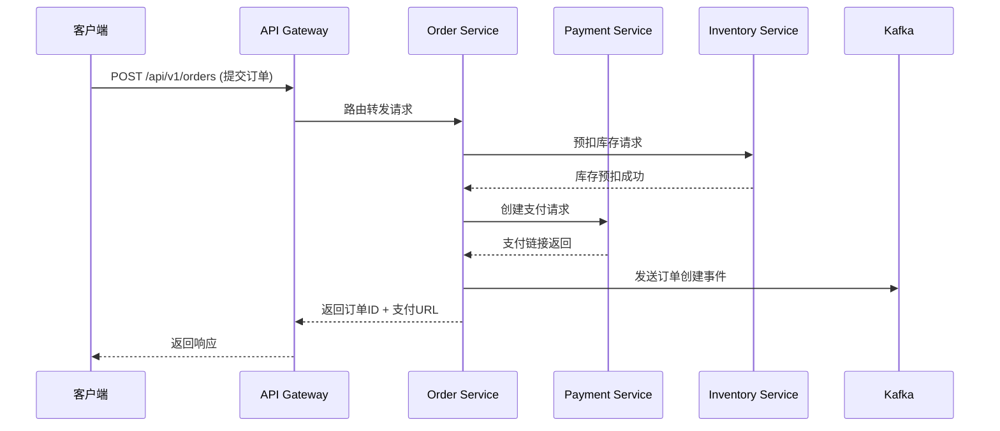

# 订单中心系统架构设计与模块说明

| 文档版本 | 修改日期 | 修改人 | 修改内容 | 审批人 |
|---------|---------|-------|---------|-------|
| V1.0 | 2024-03-15 | 张明 | 初始版本创建 | 李伟 |
| V1.1 | 2024-05-20 | 王芳 | 增加分布式事务处理说明 | 李伟 |
| V1.2 | 2024-07-10 | 赵强 | 优化订单状态机流转逻辑 | 李伟 |

**负责人**：王芳 (订单中心技术负责人)  
**适用范围**：电商平台订单中心系统，适用于所有在线交易场景  
**关联文档**：`订单中心接口规范 V2.1`、`支付中心系统架构文档 V3.0`、`库存中心数据模型设计 V1.3`

---

## 1. 系统概述

订单中心系统负责处理电商平台中从购物车提交到订单完成的完整生命周期管理。系统采用微服务架构，核心服务部署在 Kubernetes 集群（版本 1.28）上，使用 Java 17 + Spring Boot 3.2 开发，数据库采用 MySQL 8.0 分库分表方案，缓存层使用 Redis 7.2。

系统核心目标：
- 支持日均订单量 500 万笔，峰值 QPS 达到 8000
- 订单数据最终一致性保障，不超过 3 秒
- 系统可用性 99.99%

---

## 2. 整体架构

订单中心系统采用分层架构设计，从上到下依次为：

```
┌─────────────────────────────────────────────────────┐
│                  API Gateway Layer                   │
│      (Kong Gateway 3.5 + 限流/鉴权/路由)             │
├─────────────────────────────────────────────────────┤
│                  Service Layer                       │
│  ┌─────────┐ ┌─────────┐ ┌─────────┐ ┌─────────┐  │
│  │ Order   │ │ Payment │ │ Refund  │ │ After   │  │
│  │ Service │ │ Service │ │ Service │ │SaleSvc  │  │
│  └─────────┘ └─────────┘ └─────────┘ └─────────┘  │
├─────────────────────────────────────────────────────┤
│                  Data Layer                         │
│  ┌─────────┐ ┌─────────┐ ┌─────────┐ ┌─────────┐  │
│  │ MySQL   │ │ Redis   │ │ Kafka   │ │ MQ      │  │
│  │ (分库)  │ │ (缓存)  │ │ (消息)  │ │ (延迟)  │  │
│  └─────────┘ └─────────┘ └─────────┘ └─────────┘  │
├─────────────────────────────────────────────────────┤
│                  Infrastructure Layer               │
│      (K8s 1.28 / Prometheus + Grafana / ELK)        │
└─────────────────────────────────────────────────────┘
```

### 2.1 核心交互流程

订单创建流程（简化版）：



---

## 3. 模块详细设计

### 3.1 订单服务 (Order Service)

**功能职责**：订单的创建、查询、修改、取消等核心操作

**数据库设计**：
订单表采用 `user_id` 哈希分库分表（16库 × 64表），分片键配置如下：

```sql
-- 示例：订单主表结构
CREATE TABLE `order_info_${table_suffix}` (
  `order_id` BIGINT NOT NULL COMMENT '订单ID（雪花算法）',
  `user_id` BIGINT NOT NULL COMMENT '用户ID',
  `order_status` TINYINT NOT NULL DEFAULT 0 COMMENT '订单状态：0-待支付 1-已支付 2-已发货 3-已完成 4-已取消 5-售后中',
  `total_amount` DECIMAL(12,2) NOT NULL COMMENT '订单总金额',
  `payment_amount` DECIMAL(12,2) DEFAULT NULL COMMENT '实付金额',
  `create_time` DATETIME NOT NULL DEFAULT CURRENT_TIMESTAMP,
  `update_time` DATETIME NOT NULL DEFAULT CURRENT_TIMESTAMP ON UPDATE CURRENT_TIMESTAMP,
  PRIMARY KEY (`order_id`),
  KEY `idx_user_id` (`user_id`),
  KEY `idx_create_time` (`create_time`)
) ENGINE=InnoDB DEFAULT CHARSET=utf8mb4 COMMENT='订单主表';
```

**核心接口示例**：

```java
// OrderService.java - 订单创建接口
@Service
public class OrderService {
    
    @Autowired
    private OrderRepository orderRepository;
    @Autowired
    private InventoryClient inventoryClient;
    @Autowired
    private PaymentClient paymentClient;
    @Autowired
    private EventPublisher eventPublisher;
    
    @Transactional(rollbackFor = Exception.class)
    public OrderCreateResponse createOrder(OrderCreateRequest request) {
        // 1. 参数校验
        validateRequest(request);
        
        // 2. 生成订单ID（雪花算法）
        Long orderId = SnowflakeIdGenerator.nextId();
        
        // 3. 预扣库存（TCC模式）
        boolean inventoryResult = inventoryClient.preDeduct(request.getSkuList(), orderId);
        if (!inventoryResult) {
            throw new BusinessException("库存不足");
        }
        
        // 4. 创建订单记录
        OrderInfo order = OrderInfo.builder()
            .orderId(orderId)
            .userId(request.getUserId())
            .orderStatus(OrderStatus.PENDING_PAYMENT.getCode())
            .totalAmount(calculateTotal(request.getSkuList()))
            .build();
        orderRepository.save(order);
        
        // 5. 异步发送创建事件
        eventPublisher.publish(new OrderCreatedEvent(orderId, request.getUserId()));
        
        return OrderCreateResponse.builder()
            .orderId(orderId)
            .paymentUrl(generatePaymentUrl(orderId))
            .build();
    }
}
```

### 3.2 订单状态机

订单状态采用有限状态机实现，定义如下：

| 当前状态 | 触发事件 | 下一状态 | 执行操作 |
|---------|---------|---------|---------|
| 待支付 | 支付成功 | 已支付 | 扣减库存、发送发货通知 |
| 待支付 | 超时取消 | 已取消 | 释放预扣库存 |
| 待支付 | 手动取消 | 已取消 | 释放预扣库存 |
| 已支付 | 发货 | 已发货 | 更新物流信息 |
| 已发货 | 确认收货 | 已完成 | 完成支付结算 |
| 已完成 | 申请售后 | 售后中 | 启动退款流程 |

### 3.3 分布式事务处理

由于订单涉及多个服务（库存、支付、物流），采用 **TCC (Try-Confirm-Cancel)** 模式保证最终一致性：

```java
// TCC 事务管理器配置
@Configuration
public class TccTransactionConfig {
    
    @Bean
    public TccTransactionManager tccTransactionManager() {
        TccTransactionManager manager = new TccTransactionManager();
        manager.setTransactionTimeout(30); // 30秒超时
        manager.setRetryTimes(3);          // 最大重试3次
        manager.setCompensateStrategy(CompensateStrategy.SAGA);
        return manager;
    }
}
```

事务执行流程：
1. **Try 阶段**：预扣库存、冻结支付金额、锁定订单
2. **Confirm 阶段**：确认库存扣减、执行真实支付、更新订单状态
3. **Cancel 阶段**：释放预扣库存、退还冻结金额、标记订单为取消

### 3.4 消息队列配置

使用 Kafka 作为异步消息引擎，核心 Topic 配置：

```yaml
# application.yml - Kafka 配置
spring:
  kafka:
    bootstrap-servers: kafka-cluster:9092
    producer:
      key-serializer: org.apache.kafka.common.serialization.StringSerializer
      value-serializer: org.apache.kafka.common.serialization.StringSerializer
      acks: all
      retries: 3
    consumer:
      group-id: order-group
      enable-auto-commit: false
      max-poll-records: 500

# Topic 定义
order:
  topics:
    order-created: order.event.created     # 订单创建事件
    order-paid: order.event.paid           # 订单支付成功事件
    order-cancelled: order.event.cancelled # 